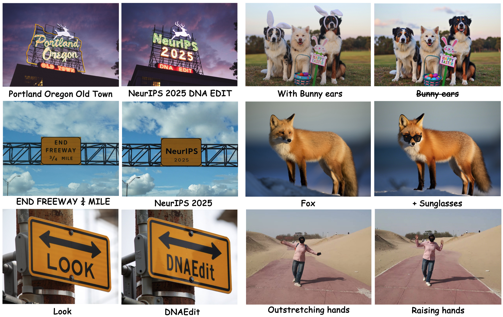
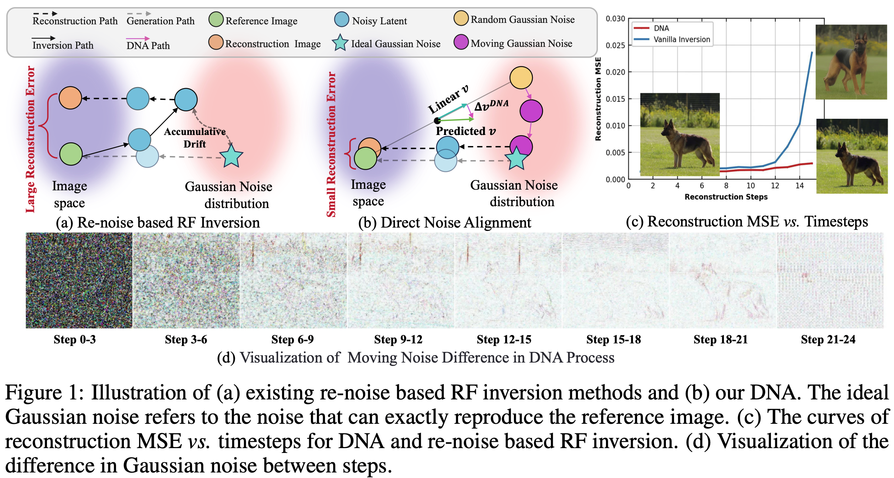
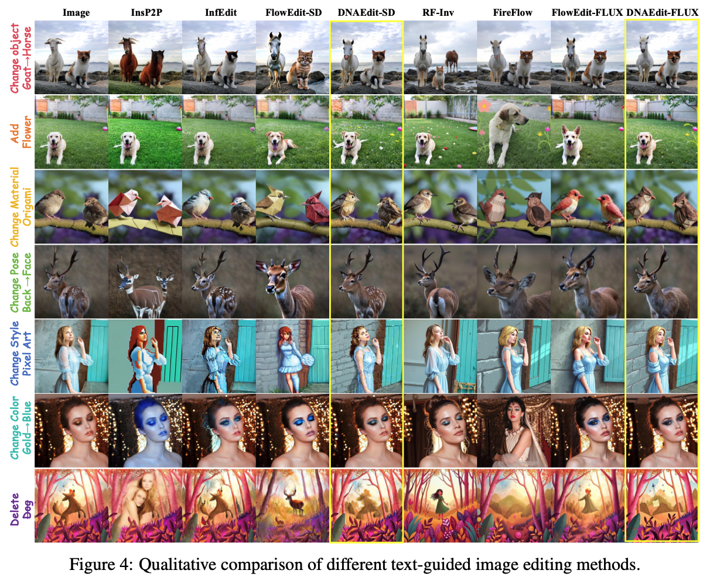

<div align="center">
<h2>DNAEdit: Direct Noise Alignment for Text-Guided Rectified Flow Editing</h2>


Chenxi Xie<sup>1,2*</sup>
| Minghan Li<sup>3*</sup> | 
Shuai Li<sup>1</sup> | 
Yuhui Wu<sup>1,2</sup> | 
Qiaosi Yi<sup>1,2</sup> | 
Lei zhang<sup>1,2</sup> 

<sup>1</sup>The Hong Kong Polytechnic University, <sup>2</sup>OPPO Research Institute <sup>3</sup>Harvard AI and Robotics Lab, Harvard University

🚩 Accepted by NeurIPS 2025 (Spotlight🌟)

<a href='https://arxiv.org/pdf/2506.01430'></a>
<a href='https://xiechenxi99.github.io/DNAEdit/'></a>




</div>

# 📖Abstract

**1. Reduces Inversion Error Accumulation**: Unlike conventional diffusion/RF inversion (which approximates later noisy latents with current ones), **DNA optimizes Gaussian noise directly in the noise domain**. It adjusts noise via velocity field differences, leveraging RF’s noise-clean image interpolation property to fundamentally reduce errors.

**2. Balances Editing & Background Preservation**: The supporting MVG module controls text-guided generation, ensuring target editability while maximizing original background retention.

**3. Introduces DNA-Bench**: A long-prompt benchmark addressing simple-prompt limitations in existing tests, enabling comprehensive evaluation of advanced editing models.


# 📖Experiment
### Visual comparison on PIE-Bench


### Video Editing results
```HTML
<video controls src="fig/0001.mp4" title="Title"></video> Bus🚌->Train🚄
<video controls src="fig/0009.mp4" title="Title"></video> Bear🐻->Panda🐼
 <video controls src="fig/0046.mp4" title="Title"></video> Swan🦢->Flamingo🦩
  <video controls src="fig/0062.mp4" title="Title"></video> Elephant🐘->Rhinoceros🦏

```
*Edting samples are from [Five-Bench](https://sites.google.com/view/five-benchmark?pli=1)*
# ⏰ TODO

- [x] Add gradio demo.
- [x] Add Video Editing on Wan 2.1


## DNAEdit
### 1️⃣ Install

1. Environment: torch=2.3.1 diffusers==0.30.1
2. Download the checkpoint [SD-3.5-meidum](https://huggingface.co/stabilityai/stable-diffusion-3.5-medium) or [FLUX.1 Dev](https://huggingface.co/black-forest-labs/FLUX.1-dev) on Huggingface


### 2️⃣ Inference on PIE-Bench （DNA-Bench）
1. Modify the path of PIE-Bench and your Diffusion models checkpoints in scripts/run_script_dnaedit.py
2. run: 
    running on SD3.5-medium
    ```
    python scripts/run_script_dnaedit.py --device_number 0 --exp_yaml configs/DNAEdit_SD3_exp.yaml --save ./output
    ```
    or running on FLUX.1 Dev

    ```
    python scripts/run_script_dnaedit.py --device_number 0 --exp_yaml configs/DNAEdit_FLUX_exp.yaml --save ./output
    ```
3. If you want to inference on **DNA-Bench**, you can simply modify the json path as 'DNA-Bench/long_mapping_file.json' .
### 3️⃣ Inference on Your Image
#### Quick Start
1. **Configure Model Path**
   
   Edit `app.py` and set your FLUX model path:
   ```python
   pipe = FluxPipeline.from_pretrained(
       "path/to/your/FLUX-dev",  # Change this
       torch_dtype=torch.float16
   )
2. **Launch gradio Demo**
    ```bash
    python app.py
    ```
    Open http://localhost:7860 in your browser.
3. **How to use**

    **Step 1** : Load Model and Upload Image
    1. First, load the model by selecting your preferred model and clicking the **⬇️ Load Model** button
    2. Wait until the status shows ✅ **Model loaded successfully**
    3. Upload the image you want to edit

    **Step 2**: Set Prompts

    Provide a description of your input image as the **Source Prompt**.

    **⚠️ Important Note:** The more accurate your image description, the more precise the editing will be and the higher the fidelity to the original image. 

    You can use existing VLM to generate accurate captions such as **Qwen-VL, Doubao**.

    You also need to provide a description of your desired edited result as the **Target Prompt**.

    **💡 Tip:** Keep the grammatical structure as similar as possible to the Source Prompt, only changing the specific elements you want to edit.

    **Step 3** : Configure Parameters and Start Editing

    Set the following 4 parameters before editing:


    ##### Parameter Setting Tips

    *T_step (Total Steps)*
    - For **FLUX models**: Set to **28**
    - For other models: Adjust according to model requirements

    *T_start (Starting Skip Steps)*
    - **Recommended**: 4
    - **Effect**: Balances editability and faithfulness
    - Lower values (e.g., 2-3): Stronger editing capability, more significant changes
    - Higher values (e.g., 5-8): More faithful to original image, subtle edits

    *CFG*
    - **Recommended**: 2.0 - 2.5
    - **Warning**: Values too small (<1.5) or too large (>4.0) will produce poor quality results
    - Optimal range provides best balance between prompt adherence and image quality

    *MVG Coefficient*
    - **Recommended**: ~0.85 (0.80 - 0.90)
    - **Effect**: Controls editing strength
    - Higher values (0.9-1.0): Stronger editing effects, more dramatic changes
    - Lower values (0.7-0.8): More faithful to original image, subtle modifications

    **Step 4** : Start Editing
    1. Click the **🚀 Start Editing** button
    2. Monitor the progress bar during processing
    3. View the edited result in the **Editing Result** panel


## 🌏 Citation

```bash
@article{xie2025dnaedit,
  title={DNAEdit: Direct Noise Alignment for Text-Guided Rectified Flow Editing},
  author={Xie, Chenxi and Li, Minghan and Li, Shuai and Wu, Yuhui and Yi, Qiaosi and Zhang, Lei},
  journal={arXiv preprint arXiv:2506.01430},
  year={2025}
}
```


### License
This project is released under the [Apache 2.0 license](LICENSE).

### Acknowledgement
The code is largely based on [FlowEdit](https://github.com/fallenshock/FlowEdit) whom we thank for their excellent work.

### Contact
If you have any questions, please contact: chenxi.xie@connect.polyu.hk


<details>
<summary>statistics</summary>


</details>
